# Vulkan Vxgi VR Engine

* University of Pennsylvania, CIS 565: GPU Programming and Architecture, Final Project
* Byumjin Kim & Josh Lawrence 

# Demo Video

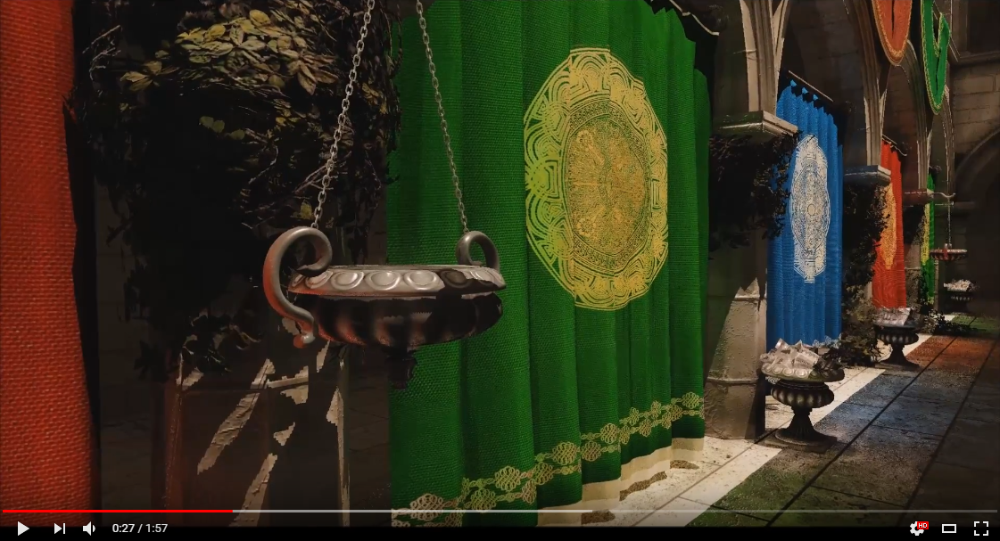

# Overview

We have implemented Voxel Global illumination and VR pipeline with Vulkan for the final project of GPU programming.
We have decided to use Vulcan to implement what each team member is interested in. 
However, the relevance of the objects was too different each other, and the scale was too large to merge them in a given time.
Thus, we could not use most of our time to collaborate.
Byumjin Kim have taken to implement the engine base and VXGI which referred to [Interactive indirect illumination using voxel cone tracing](http://citeseerx.ist.psu.edu/viewdoc/download?doi=10.1.1.225.5903&rep=rep1&type=pdf), and Josh Lawrence have taken the VR mode and the part for interacting with Oculus HMD.

## Deferred Rendering

We chose deferred rendering as our base rendering system, which makes it easier to apply post-process effects.
It uses four G buffers (Albido, Specular, Normal and Emissive) to store information needed for PBR.

| Debug display | G-buffer structure |
| --- | --- |
|  |  |

## HDR

HDR can represent a greater range of luminance levels than can be achieved using more 'traditional' methods, such as many real-world scenes containing very bright, direct sunlight to extreme shade, or very faint nebulae.

### Bloom Effect

I have used HDR for creating bloom effect the simplest and effective post-process effect.
First, I extracted the very bright region from the scene image, then obtain the desired image contrast through color's scale and bias.

| Extracted HDR Color |
| --- |
|  |

After that, two-pass seperable gaussian blur can be used to obtain the bloom effect.
However, typically, using a frame buffer of the same resolution is not large enough to get satisfied the size of the kernel.
In order to solve this problem, the size of the blur kernel was increased by applying 1/2 down-sampling for each stage of blur.

The interesting point is, I've tried both the traditional fragment shader approach and the compute shader (using shared memory), but unlike the expectation, the compute shader version showed a slower performance.

| 1/2 horizon blur | 1/4 vertical blur | 1/8 horizon blur | 1/8 vertical blur|
| --- | --- | --- | --- |
| 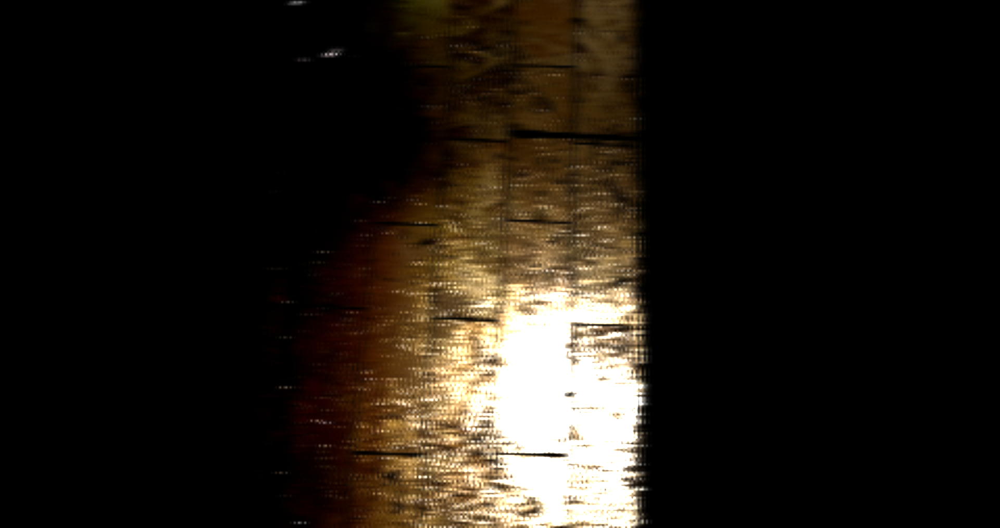 | 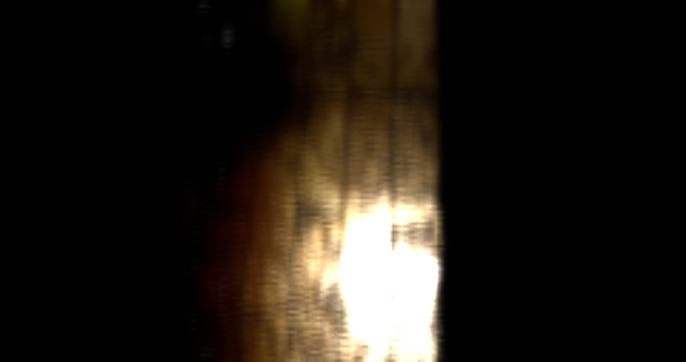 | 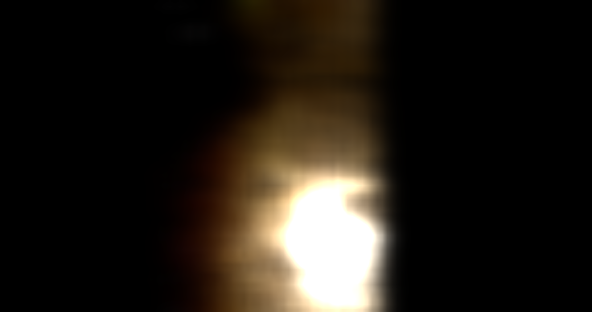 | 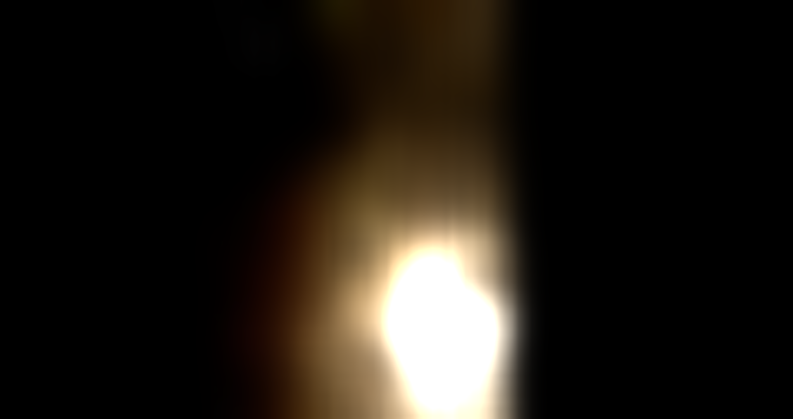 |

### Tone Mapping

Tone mapping is the easiest and most effective way to get a more realistic scene.
First, I applied a low temperature color(3600K) to give a feeling of dawn.
After that, applied RomBinDaHouse Tone Mapping, which was effective in highlighting the contrast of our scene.

| Original Color | Color temperature | RomBinDaHouse tone mapping |
| --- | --- | --- |
|  | 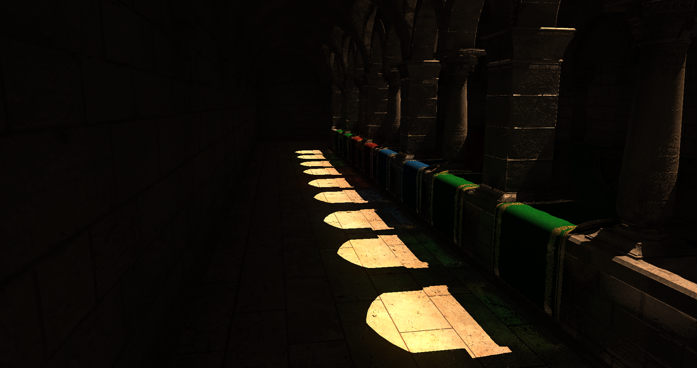 | 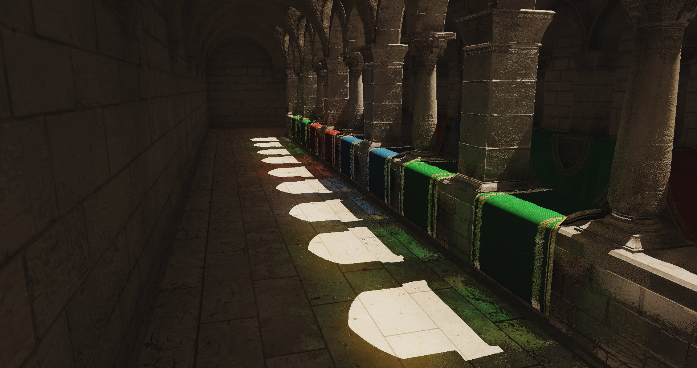 |

## Voxel Global illumination

I referred to a paper [Interactive indirect illumination using voxel cone tracing](http://citeseerx.ist.psu.edu/viewdoc/download?doi=10.1.1.225.5903&rep=rep1&type=pdf) published in Nvidia, which uses Voxelizied meshes to obtain GI with using cone tracing.

### Voxelization

First, the area of ​​the scene to be voxelized is determined, and the objects contained in the scene are voxelized into triangles.
That is, in the geometry shader, an axis providing the widest area when each triangle is projected among the world x, y and z axis is selected using the normal vector of the rectangle, and the projection is performed based on the axis. Then, conservative rasterization is applied to prevent to generate missing voxels.
Finally, in the paper, it constructs SVO by creating a fragment list by collecting fragments generated from a fragment shader, but I simply stored information of voxels using 3d texture, which has 512x512x512 resolution.

| Voxelized Meshes |
| --- |
|  |

### Mip-Mapping

 
The generated 3d texture should have mip-mapped values ​​step by step for voxel cone tracing.
OpenGL supports automatic mipmap generation, but Vulkan is not, so I had to do it manually.
To accomplish this, I used a compute shader for each mipmap stage to create a new mipmap by level.
But, this process was so slow that dynamic 3d texture mipmapping was not possible in real time.
So, I had to get GI by voxelizing from static objects only.

| Mip level 0 | Mip level 1 | Mip level 2 | Mip level 3 |
| --- | --- | --- | --- |
|  | 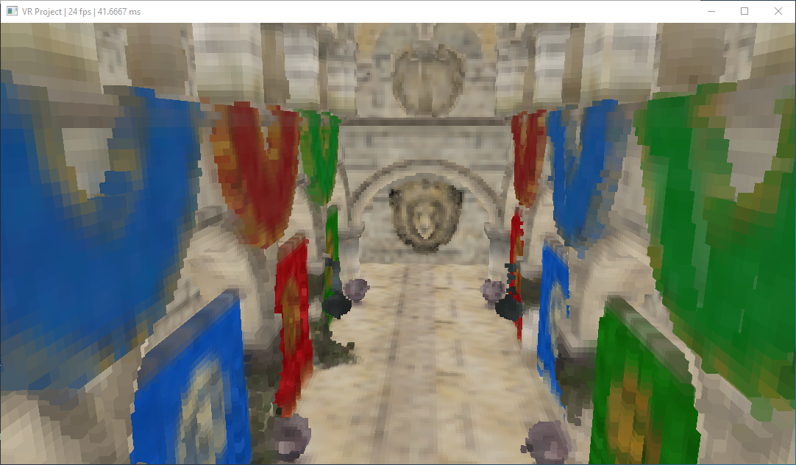 | 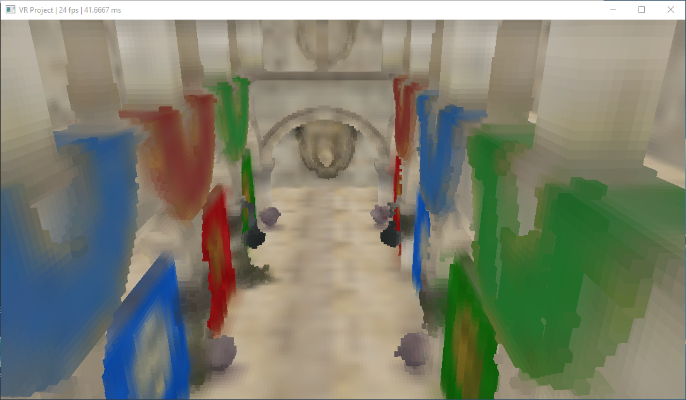 | 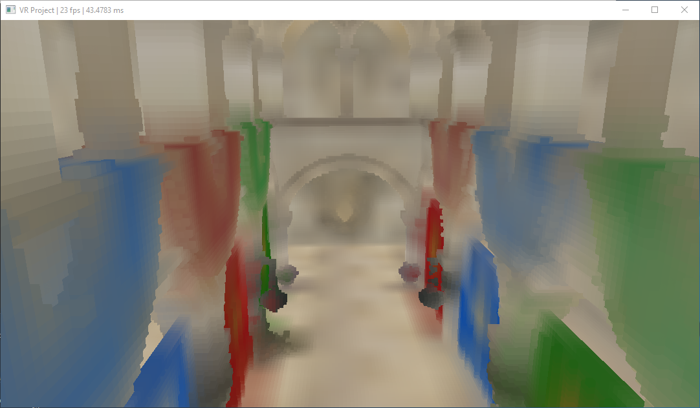 |

### Voxel-Cone tracing

Now, to get the GI, we need to do voxel cone tracing on the post process stage.
But, real voxel cone tracing is really slow in real-time.
So, using with our voxel 3dtextures' mipmapped values, we can approximate this step with using ray marching with several samples from screen space world position.
Depending on its sample distance, we can decide which mipmapped voxel values should be used.

And, before getting the sample color from the texture, determine whether the voxel is currently obscured by the shadow. 
Because the voxel in the shadow cannot actually reflect any light.
To obtain the diffuse GI, seven voxel cones of 60 degrees were used to cover the hemisphere area.

| GI Only |
| --- |
|  |

One of the advantage of using voxel contracing is that we can get ambient occlusion free.

| AO Only |
| --- |
| 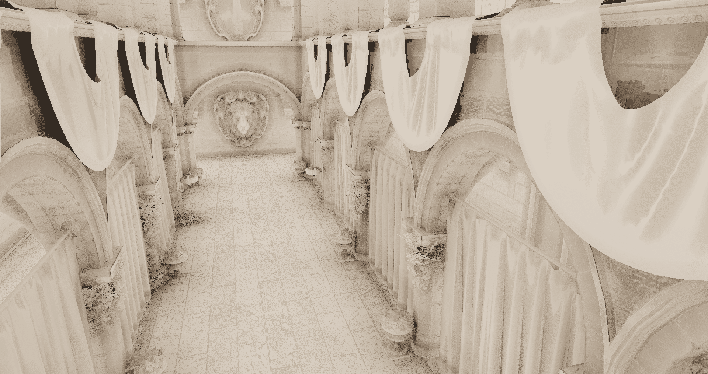 |

| Light Only | Light + AO | Light + AO + GI |
| --- |--- |--- |
| 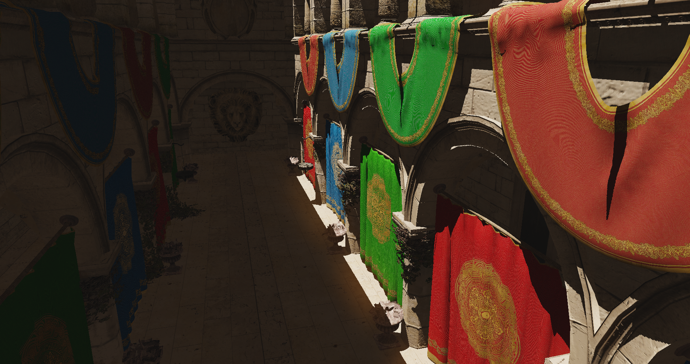 | 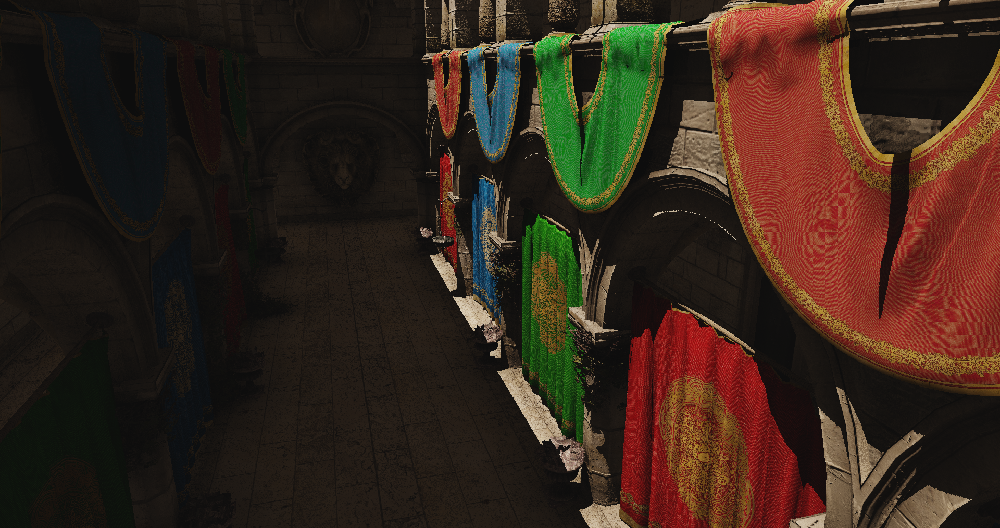 |  |

### Performance of each graphics pipeline stage

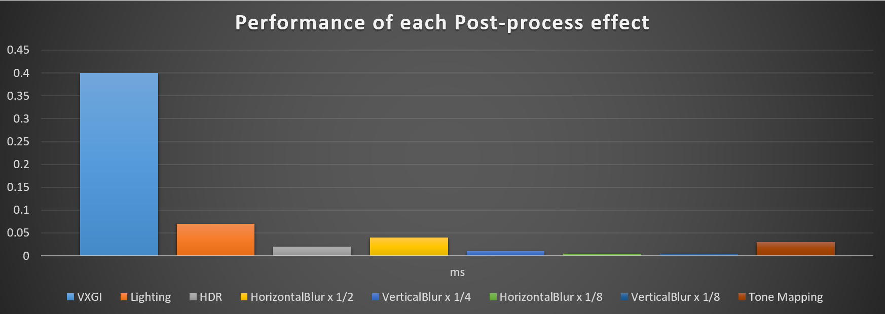

| Update Uniform Buffers | Draw Objects | Draw Shadow | Post-Process Effects | Draw Main FrameBuffer | Present KHR | TOTAL |
| --- | --- | --- | --- | --- | --- | --- |
| 1.5 ms | 1.0 ms | 0.5 ms | 0.6 ms | 5.2 ms | 0.7 ms | 9.8 ms |

### Performance of each post-process effect

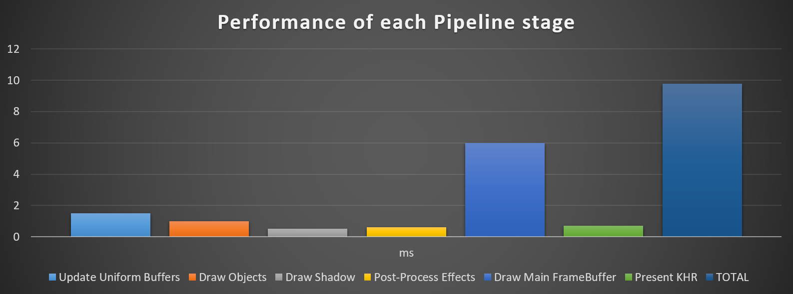

| VXGI | Lighting | HDR | HorizontalBlur x 1/2 | VerticalBlur x 1/4 | HorizontalBlur x 1/8 | VerticalBlur x 1/8 | Tone Mapping |
| --- | --- | --- | --- | --- | --- | --- | --- |
| 0.4 ms | 0.07 ms | 0.02 ms | 0.04 ms | 0.01 ms | 0.005 ms | 0.005 ms | 0.03 ms |

## VR mode

### Barrel Filter and Aberration Methods
* Based on Brown-Conrady Distortion model, but must get constants from HMD vendor
* Option 1. Do it all in frag shader (each fragment is doing the math)
* Option 2. Warp a mesh down in vertex shader and do chormatic aberration in fragment shader(or vertex shader and let the hardware interopolate, Brown-Conrady isn't linear but if the mesh is dense enough it won't matter)
* Option 3. Pre-warp the mesh and pre-calculate all chromatic aberration values up front and pack them into vertex attributes
* All of these were about the same performance (this stage didn't add anything, almost the same as passthrough, about 0.1ms more on a gtx960m)
* A forth option avoids a post process by warping the NDC positions of the drawn meshes in the vertex shader and tesselating them. I belive this requires an art team to make sure this works out for every mesh. 
* see: https://www.imgtec.com/blog/speeding-up-gpu-barrel-distortion-correction-in-mobile-vr/
for reasons why the mesh needs to be dense enough (texture sampling gets funky because of Distortion model's nonlinearity. But if you subdivide enough, things approach linearity)

### Issues with finding inverse Brown-Conrady Distortion
* I relied on the Secant Method for finding the inverse of non-invertable function in order to reverse warp the mesh in optios 2 and 3 above. 
* However, you can run into root jumping issues, which I did but got around by letting the mesh position fall where it may recalculating its UV and finding the source UV from the normal Brown-conrady distortion. It's all pre-baked anyway so it doesnt matter it we take this extra step, just so long as the end result is correct.
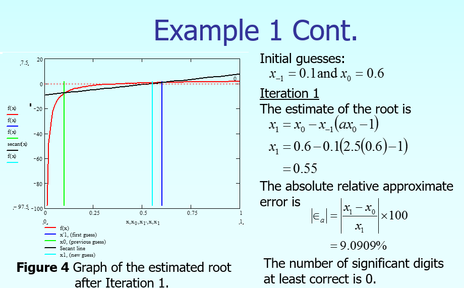
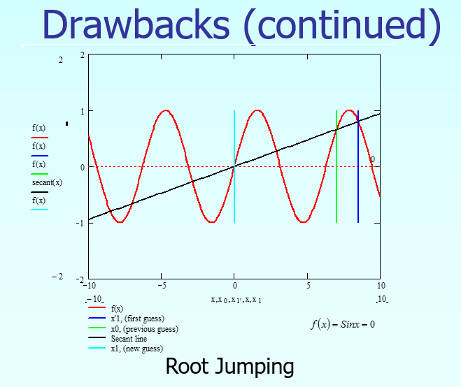
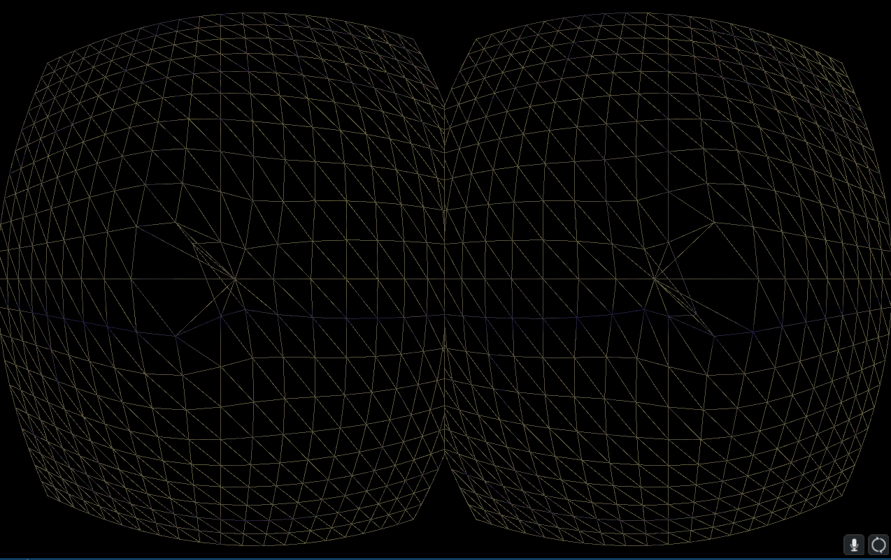

### Radial Density Masking
* see https://www.youtube.com/watch?v=DdL3WC_oBO4
* Due to barrel distortion (needed to counteract the pincushioning as the 2D image refracts though the lenses) and hits our eyes, we are over rendering at the edges of the image, by as much as 2x. Barrel distortion squeezes down a 1.4x virtual render target to the device's screen size, pixels in the center get blown out and pixels at the edge get pulled in. See below.
* Radial Density masking uses the stencil to cull 2x2 pixel quads in early-z to avoid rendering them in the fragment shader. 
* The Mask is made by hand in code and uploaded to the stencil once and is used by the forward render pass (VR renderers need forward rendering because MSAA is such a huge win for image fidelity)
* Masking is huge savings, about 20-25% off the top, the issue however is hole filling. Which can put you back where you started, it did for me.

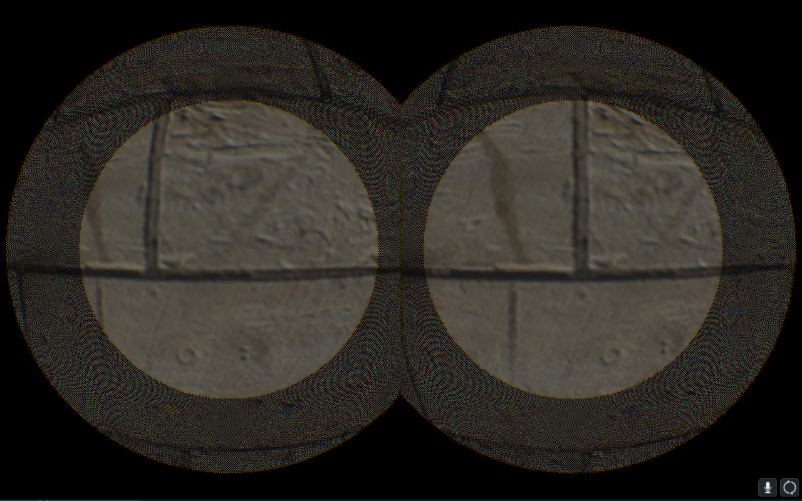

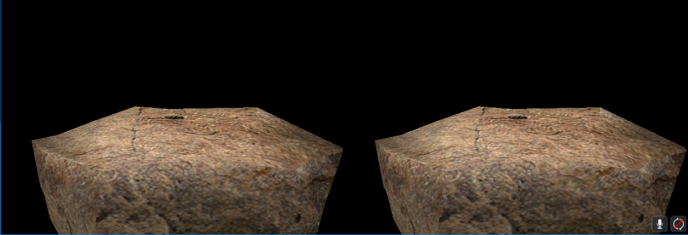

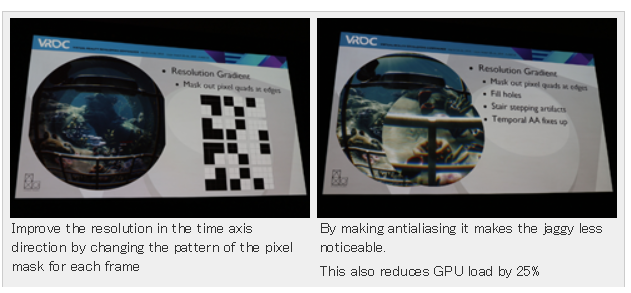

### Optimizing Stencil Hole Fill
* Remove all tex fetches from branches(needed for determining uv coords of fetches based on: 1. was it a ignored quad or not, 2: location withing quad), prefetch at the top of shader
* If you're not seeing benefits you'll see additional savings the more expensive your pixel shading is

### Is The Barrel Sampling that Dense? 
* Yes, I thought it would be possible to just precalculate a stencil that masked out the places where the barrel filter wouldn't be sampling
* The motivation for this was the expensive hole filling in radial density masking. 
** All color channels single pixel sample 

** All color channels sample pixel quad  

### Adaptive Quality Filtering
* see https://www.youtube.com/watch?v=DdL3WC_oBO4
* Async time warp and space warp are unpleasent experiences for the user, should really only be last resort. If you're using it to maintain frame rate you're creating a really uncomfortable VR experience.
* Use Adaptive quality filtering to detect when user is turning head towards an expensive view. If the last frame time starts go above some target threshold then begin to turn down settings (MSAA and virtual render target scaling (the render target size pre-barrel distortion))
* Can probably avoid async time and space warp altogether.

** Resolution scale 1.5 

** Vulkan-VR-FrameWork scale 1.0 

** Vulkan-VR-FrameWork scale 0.5 

### Vulkan Performance Things
* To limit context switches (changing shaders, mesh info, etc):
* Sift shader calls into secondary command buffers and combine into one primary so there's only one shader switch for each shader that is needed in the render pass
* use push constants for per draw call dynamic things (model matrix, bit field flags)
* have the UBO use size 2 array for the viewproj of each eye, set the viewport state to dynamic, use push constants to view port switching commands to render in one render pass. (single scene traversal still 2 draw calls)
* multithread your command building (use secondary command buffers), assemble into primary, submit.
* Reduce command buffer count, number of render passes done to build a frame
* Use subpasses when you can, requires 1 to 1 frag sampling from the output of one subpass to the input of another. Good use case would be deferred rendering.

# Data
**Performance of various Barrel/Chromatic Aberration Techniques and Radial Density Mask** 
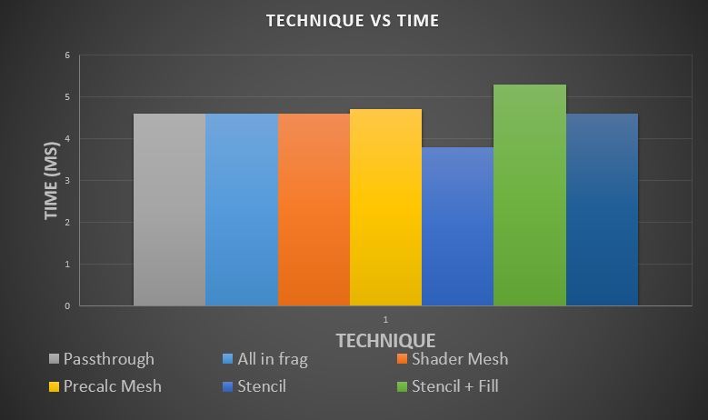

**Push Constant vs UBO updates** 
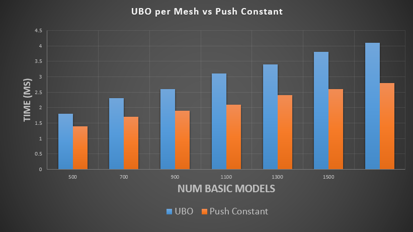

**GPU Device Properties** 
https://devblogs.nvidia.com/parallelforall/5-things-you-should-know-about-new-maxwell-gpu-architecture/ 
cuda cores 640 
mem bandwidth 86.4 GB/s 
L2 cache size 2MB 
num banks in shared memory 32 
number of multiprocessor 5 
max blocks per multiprocessor 32 
total shared mem per block 49152 bytes 
total shared mem per MP 65536 bytes 
total regs per block and MP 65536 
max threads per block 1024 
max threads per mp 2048 
total const memory 65536 
max reg per thread 255 
max concurrent warps 64 
total global mem 2G 
 
max dims for block 1024 1024 64 
max dims for a grid 2,147,483,647 65536 65536 
clock rate 1,097,5000 
texture alignment 512 
concurrent copy and execution yes 
major.minor 5.0 

# Credits: 

* [Vulkan tutorial](https://vulkan-tutorial.com/Introduction)
* [Tone mapping](https://www.shadertoy.com/view/lslGzl)
* [Color Temperature](https://www.shadertoy.com/view/lsSXW1)

# Libraries:

* [tinyobjloader](https://github.com/syoyo/tinyobjloader)
* [GLFW](http://www.glfw.org/)
* [stb-image](https://github.com/nothings/stb)

# Assets: 

* [Cerberus by Andrew Maximov](http://artisaverb.info/Cerberus.html)

