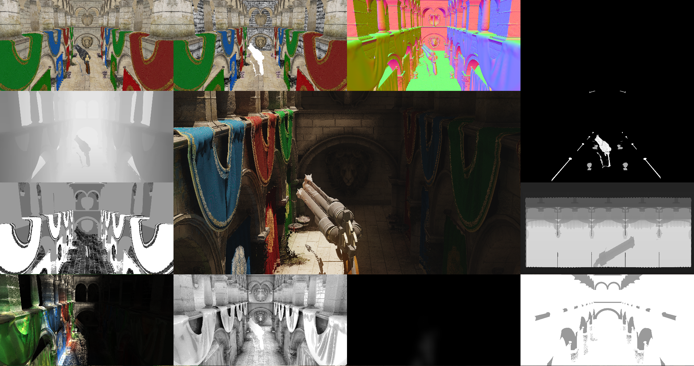
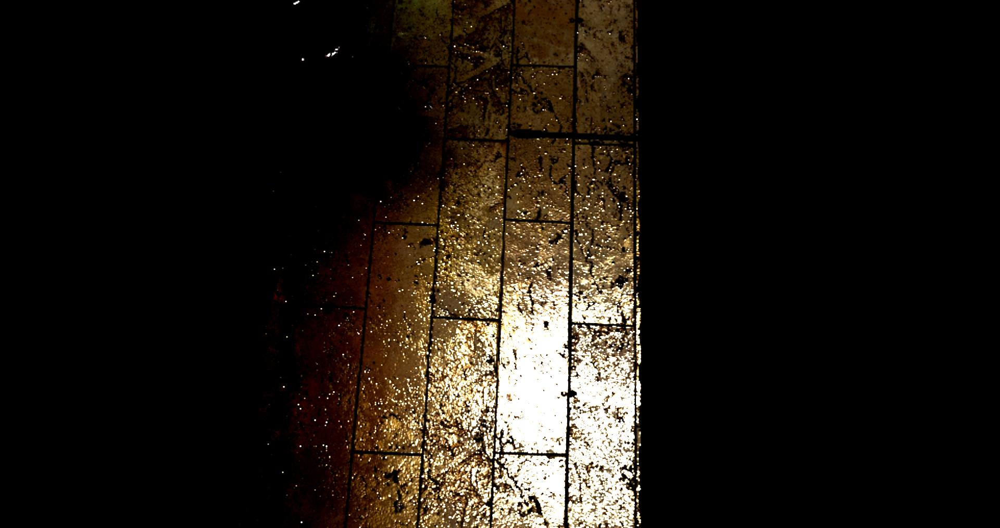
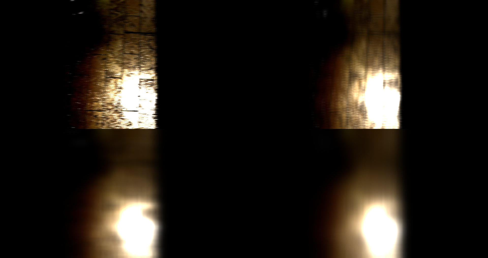
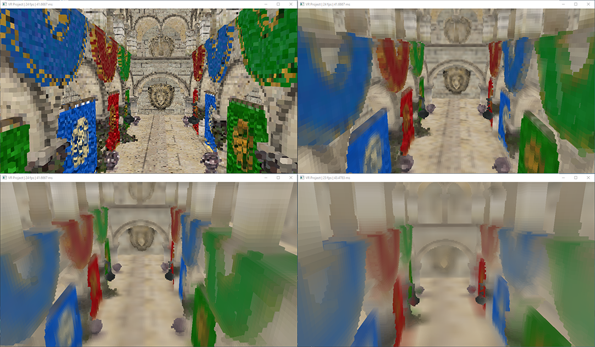
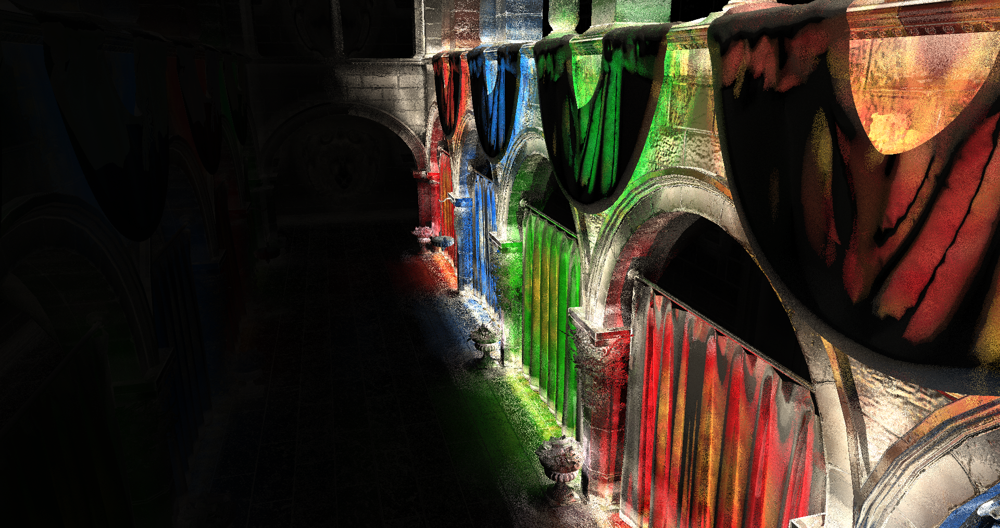
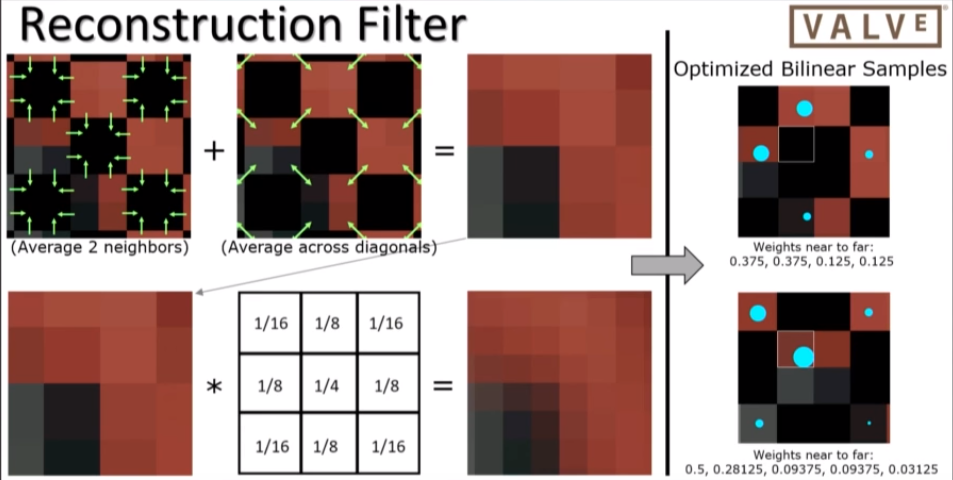
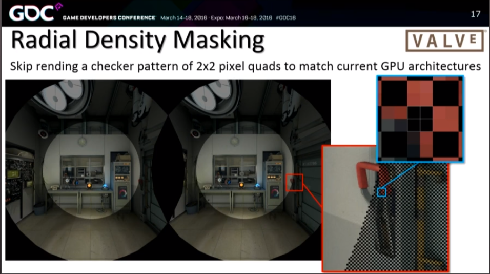
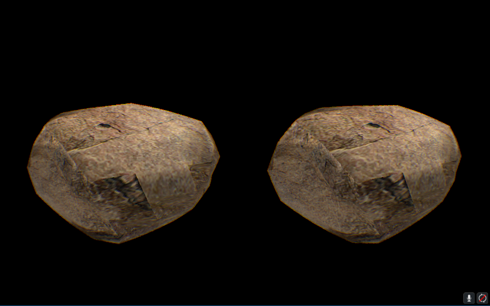
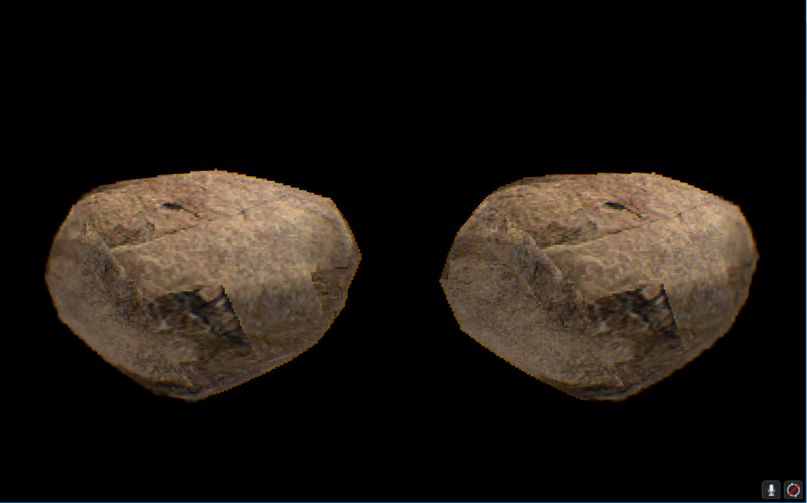

Vulkan VR Framework with Voxel Cone-tracing Global Illumination 
========================

**University of Pennsylvania, CIS 565: GPU Programming and Architecture, Final Project - Vulkan Vxgi Vr Engine**

* Byumjin Kim & Josh Lawrence 

# Overview

벌칸을 이용하여 팀원 각자가 관심있는 것을 구현하기로 하였는데, 그 대상간의 관련성이 다르고, 규모도 한 달안에 한명이서 각자의 맡은 일을 마무리 하기에는 컸기때문에 대부분의 시간을 협업하는데 사용하지 못했다. 범진 킴은 기본 엔진 베이스와 VXGI [Interactive indirect illumination using voxel cone tracing](http://citeseerx.ist.psu.edu/viewdoc/download?doi=10.1.1.225.5903&rep=rep1&type=pdf). 를 조쉬는 VR 파트를 구현하여 Oculus HMD와 이 이프로젝를 연동시켰다.

## Demo Video

## Deferred Rendering

우리는 포스트 프로세스 이펙트들의 적용을 쉽게 만들어주는 디퍼드 렌더링을 기본 렌더링 방식으로 선택하였다. 네개의 G버퍼(알비도, 스펙큘러, 노멀, 에미시브)를 사용하여 PBR에 필요한 정보를 저장한다.

## HDR

HDR can represent a greater range of luminance levels than can be achieved using more 'traditional' methods, such as many real-world scenes containing very bright, direct sunlight to extreme shade, or very faint nebulae.

### Bloom Effect

우리는 가장 간다하면서도 효과적인 bloom effect를 위해 이 기능을 사용하였다. 먼저 scene image에서 아주 밝은 영역을 추출한 다음에, 컬러 scale 과 bias를 통해 원하는 이미지의 contrast를 얻는다.

* Extracted HDR Color

 그 후, two-passes seperable gaussian blur를 사용하여 bloom effect를 얻을 수 있다. 하지만, 일반적으로, 같은 해상도의 프레임 버퍼를 사용하면 커널의 크기가 만족할 만큼 크지가 않다. 이를 해결하기 위해, 블러를 실시하는 각 stage마다 1/2 다운샘플을 실시하여 블러 커널의 크기를 증가시켰다. 재밌는점은, 전통적인 프레그먼트 셰이더를 이용한 방법과 컴퓨트 셰이더(세어드 메모리 이용)를 이용한 방법을 둘다 사용해 보았는데, 기대와는 다르게 오히려 컴퓨트 셰이더 버전이 좀 더 느린 퍼포먼스를 보여주었다.

* Blurring with down-sampling

### Tone Mapping

좀 더 실감나는 신을 얻기위해서는 Tone mapping 쉬우면서 가장 효과적인 방법이다. 먼저, 낮은 템퍼레이쳐 (3600K) 컬러 색상을 적용하여 새벽같은 느낌을 주었다. 그 후, 우리 scene의 contrast를 가장 강조하기에 효과적이었던, RomBinDaHouse Tone Mapping을 적용하였다.

* Original Color

* After adjusting color temperature

* After adjusting RomBinDaHouse tone mapping

## Voxel Global illumination

우리는 Voxelizied 된 메쉬들에 cone tracing을 사용하여 GI를 얻는 Nvidia에서 발표된 Interactive indirect illumination using voxel cone tracing 논문을 참조하였다. 

### Voxelization

먼저 복셀화 시킬 scene의 영역을 정하고, 그 안에 포함되는 오브젝트를 삼각형 단위로 복셀화 시킨다.  즉, geometry 셰이더에서 각 삼각형 마다 월드 x, y, z 축 중 project 시켰을 때 가장 넓은 면적을 제공하는 축을 사각형의 노멀벡터을 이용해 선택한 후, 그 축을 기준으로 투영시킨다. 그 후, conservative rasterization를 적용하여 missing 복셀을 방지한다. 마지막으로, 논문에서는 프래그먼트 셰이더에서 생성되는 프래그먼트만을 모아 프래그먼트 리스트를 생성하여 SVO를 구축하지만, 나는 간단히 3d texture를 사용하여 voxel들의 정보를 저장하였다. 

### Mip-Mapping

생성된 3d texture는 voxel cone tracing을 위해 mip-mapped values를 단계별로 가져야 한다. OpenGL은 자동 밉맵 생성을 지원하지만, Vulkan을 그렇지 않기에 직접 수동적으로 해주어야 했다. 이를 위해 각 밉맵 단계별로 compute shader를 사용하여 새로운 밉맵을 레벨별로 생성하였다. 이 과정이 너무 느려서, 다이나믹한 3d texture mipmapping이 리얼타임상에서 불가능 하였기 때문에, 우리는 static한 오브젝트만 voxelization 시켜 GI를 얻어 올 수 밖에 없었다.

### Voxel-Cone tracing

Now, to get the GI, we need to do voxel cone tracing on the post process stage.
But, real voxel cone tracing is really slow in real-time.
So, using with our voxel 3dtextures' mipmapped values, we can approximate this step with using ray marching with several samples from screen space world position.
Depending on its sample distance, we can decide which mipmapped voxel values should be used.

* Lighting Only

* GI Only

And, 텍스쳐에서 샘플 컬러를 가져오기 전에, 현재 그 복셀이 그림자에 가려져 있는지 아닌지의 여부를 파악한다. 왜냐하면, 그림자에 가져린 복셀은 사실 아무런 빛을 반사 할 수 없기 때문이다. 디퓨즈 GI를 갖고 오기 위하여, 60도의 복셀콘 7개를 사용하여 hemisphere 영역을 커버하였다. 한가지 좋은 점은, 이 복셀콘들을 그대로 이용하여 Ambient Occlusion 얻을 수 있다.

* AO Only

* Lighting with AO

* Lighting + GI with AO

## VR mode

### Barrel Filter and Aberration Methods
* Based on Brown-Conrady Distortion model, but must get constants from HMD vendor
* Option 1. Do it all in frag shader (each fragment is doing the math)
* Option 2. Warp a mesh down in vertex shader and do chormatic aberration in fragment shader(or vertex shader and let the hardware interopolate, Brown-Conrady isn't linear but if the mesh is dense enough it won't matter)
* Option 3. Pre-warp the mesh and pre-calculate all chromatic aberration values up front and pack them into vertex attributes
* All of these were about the same performance (this stage didn't add anything, almost the same as passthrough, about 0.1ms more on a gtx960m)
* A forth option avoids a post process by warping the NDC positions of the drawn meshes in the vertex shader and tesselating them. I belive this requires an art team to make sure this works out for every mesh. 
* see: https://www.imgtec.com/blog/speeding-up-gpu-barrel-distortion-correction-in-mobile-vr/
for reasons why the mesh needs to be dense enough (texture sampling gets funky because of Distortion model's nonlinearity. But if you subdivide enough, things approach linearity)

### Issues with finding inverse Brown-Conrady Distortion
* I relied on the Secant Method for finding the inverse of non-invertable function in order to reverse warp the mesh in optios 2 and 3 above. 
* However, you can run into root jumping issues, which I did but got around by letting the mesh position fall where it may recalculating its UV and finding the source UV from the normal Brown-conrady distortion. It's all pre-baked anyway so it doesnt matter it we take this extra step, just so long as the end result is correct.

### Radial Density Masking
* see https://www.youtube.com/watch?v=DdL3WC_oBO4
* Due to barrel distortion (needed to counteract the pincushioning as the 2D image refracts though the lenses) and hits our eyes, we are over rendering at the edges of the image, by as much as 2x. Barrel distortion squeezes down a 1.4x virtual render target to the device's screen size, pixels in the center get blown out and pixels at the edge get pulled in. See below.
* Radial Density masking uses the stencil to cull 2x2 pixel quads in early-z to avoid rendering them in the fragment shader. 
* The Mask is made by hand in code and uploaded to the stencil once and is used by the forward render pass (VR renderers need forward rendering because MSAA is such a huge win for image fidelity)
* Masking is huge savings, about 20-25% off the top, the issue however is hole filling. Which can put you back where you started, it did for me.

### Optimizing Stencil Hole Fill
* Remove all tex fetches from branches(needed for determining uv coords of fetches based on: 1. was it a ignored quad or not, 2: location withing quad), prefetch at the top of shader
* If you're not seeing benefits you'll see additional savings the more expensive your pixel shading is

### Is The Barrel Sampling that Dense? 
* Yes, I thought it would be possible to just precalculate a stencil that masked out the places where the barrel filter wouldn't be sampling
* The motivation for this was the expensive hole filling in radial density masking. 
** All color channels single pixel sample 

** All color channels sample pixel quad  

### Adaptive Quality Filtering
* see https://www.youtube.com/watch?v=DdL3WC_oBO4
* Async time warp and space warp are unpleasent experiences for the user, should really only be last resort. If you're using it to maintain frame rate you're creating a really uncomfortable VR experience.
* Use Adaptive quality filtering to detect when user is turning head towards an expensive view. If the last frame time starts go above some target threshold then begin to turn down settings (MSAA and virtual render target scaling (the render target size pre-barrel distortion))
* Can probably avoid async time and space warp altogether.

** Resolution scale 1.5 

** Vulkan-VR-FrameWork scale 1.0 

** Vulkan-VR-FrameWork scale 0.5 

### Vulkan Performance Things
* To limit context switches (changing shaders, mesh info, etc):
* Sift shader calls into secondary command buffers and combine into one primary so there's only one shader switch for each shader that is needed in the render pass
* use push constants for per draw call dynamic things (model matrix, bit field flags)
* have the UBO use size 2 array for the viewproj of each eye, set the viewport state to dynamic, use push constants to view port switching commands to render in one render pass. (single scene traversal still 2 draw calls)
* multithread your command building (use secondary command buffers), assemble into primary, submit.
* Reduce command buffer count, number of render passes done to build a frame
* Use subpasses when you can, requires 1 to 1 frag sampling from the output of one subpass to the input of another. Good use case would be deferred rendering.

# Data
**Performance of various Barrel/Chromatic Aberration Techniques and Radial Density Mask** 

**Push Constant vs UBO updates** 

**GPU Device Properties** 
https://devblogs.nvidia.com/parallelforall/5-things-you-should-know-about-new-maxwell-gpu-architecture/ 
cuda cores 640 
mem bandwidth 86.4 GB/s 
L2 cache size 2MB 
num banks in shared memory 32 
number of multiprocessor 5 
max blocks per multiprocessor 32 
total shared mem per block 49152 bytes 
total shared mem per MP 65536 bytes 
total regs per block and MP 65536 
max threads per block 1024 
max threads per mp 2048 
total const memory 65536 
max reg per thread 255 
max concurrent warps 64 
total global mem 2G 
 
max dims for block 1024 1024 64 
max dims for a grid 2,147,483,647 65536 65536 
clock rate 1,097,5000 
texture alignment 512 
concurrent copy and execution yes 
major.minor 5.0 

